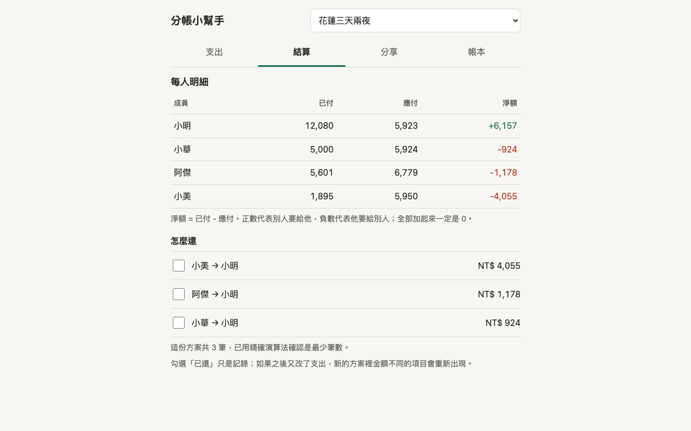

# 分帳小幫手
A mobile-first web app that splits trip and dinner expenses among friends and computes the fewest transfers to settle up.

Demo：https://useless-husband.github.io/split-bill/



朋友出遊、聚餐之後，用來算「誰該給誰多少錢」。純靜態網頁，不需要註冊、不需要伺服器，資料只存在你自己的瀏覽器。

## 功能

- 多個帳本（例如「花蓮三天兩夜」「週五火鍋」），各自有成員名單，存在 localStorage；可切換、改名、刪除。刪除用頁內確認，不會跳出瀏覽器對話框。
- 新增支出：項目、金額、日期、分類（餐飲、交通、住宿、門票、其他）、誰付的（可多人各付一部分）、分給誰。
- 四種分法：均分、按份數、指定金額、百分比。
- 金額全部用新台幣整數「元」計算，內部沒有浮點數。除不盡的零頭依固定規則分配，加總一定完全相等。
- 外幣支出：輸入外幣金額與手動匯率，換算成新台幣（四捨五入）。
- 結算：每人已付、應付、淨額，以及「最少轉帳次數」的還款方案，可勾選「已還」。
- 分享：一鍵複製可貼到 LINE 的純文字摘要；帳本 JSON 匯出／匯入；把整本帳本壓縮進網址 hash 分享。
- 支出列表可依分類、依成員篩選，並顯示分類小計。
- 支援淺色／深色模式，手機寬度（390px）可用，鍵盤可操作。

## 安裝與執行

不用安裝任何套件。這個專案沒有建置步驟，也沒有相依套件。

**直接使用**：打開上面的 Demo 連結即可。

**在自己的電腦上跑**（需要 Python 3 或 Node.js 其中一個，用來開本機網頁伺服器；ES module 不能直接用 `file://` 開啟）：

1. 下載專案並進入資料夾
   ```bash
   git clone https://github.com/useless-husband/split-bill.git
   cd split-bill
   ```
2. 啟動本機伺服器（擇一）
   ```bash
   python3 -m http.server 8000
   ```
   或
   ```bash
   npx serve .
   ```
3. 用瀏覽器打開 http://localhost:8000

第一次打開會看到「建立第一本帳本」，也可以按「先看範例帳本」載入示範資料。

## 使用範例

範例帳本「花蓮三天兩夜」有 4 位成員、6 筆支出（含一筆日圓標價、一筆多人分開付、一筆按份數、一筆指定金額），合計 NT$ 24,576。結算頁的結果：

| 成員 | 已付 | 應付 | 淨額 |
| --- | ---: | ---: | ---: |
| 小明 | 12,080 | 5,923 | +6,157 |
| 小華 | 5,000 | 5,924 | -924 |
| 阿傑 | 5,601 | 6,779 | -1,178 |
| 小美 | 1,895 | 5,950 | -4,055 |

「分享」頁複製出來、可直接貼到 LINE 的文字：

```
【花蓮三天兩夜】分帳結算
共 6 筆支出，合計 NT$ 24,576

每人明細(已付 / 應付 / 淨額)
小明：12,080 / 5,923 / +6,157
小華：5,000 / 5,924 / -924
阿傑：5,601 / 6,779 / -1,178
小美：1,895 / 5,950 / -4,055

怎麼還
1. 小美 → 小明　NT$ 4,055
2. 阿傑 → 小明　NT$ 1,178
3. 小華 → 小明　NT$ 924
```

## 專案結構

```
index.html          頁面（相對路徑、不需建置）
style.css           樣式（淺色／深色）
src/money.js        整數金額、零頭分配 allocate()、外幣換算 toTWD()
src/ledger.js       帳本資料模型、支出驗證、分攤計算、餘額、篩選與小計
src/settle.js       貪婪法與精確法（最少轉帳）、方案驗證
src/share.js        LINE 摘要、JSON 匯出／匯入（含防呆）、網址 hash 壓縮
src/store.js        localStorage 讀寫（壞資料不會當機）
src/demo.js         範例帳本
src/form.js         新增／編輯支出表單
src/dom.js          極簡 DOM 建構函式
src/app.js          畫面與事件
test/               node --test 測試
.github/workflows/  CI
```

## 如何跑測試

需要 Node.js 20 以上，沒有任何相依套件：

```bash
node --test "test/*.test.js"
```

共 58 個測試，包含：各種分法、零頭分配加總守恆、多人付款、淨額加總為 0、轉帳方案正確性、匯入壞資料防呆，以及 property-based 隨機測試（隨機產生 1000 組帳本，驗證金額守恆、方案能把所有人結清、精確法筆數不多於貪婪法；另有 500 組小型案例與暴力法比對最少筆數）。

## 原理簡介

**零頭怎麼分。** 100 元三人均分，每人先拿 `floor(100 / 3) = 33`，剩下的 1 元要有人多付。規則是：從「輪替起點」開始，依成員順序每人多 1 元。輪替起點是「這是帳本的第幾筆支出」，所以第 1 筆多付的是第 1 位，第 2 筆是第 2 位，依此類推，長期下來每個人多付的機會一樣。按份數與百分比也是同樣做法：先各自無條件捨去，再把剩下的零頭依序補 1 元。這個規則完全由輸入決定，同樣的資料永遠得到同樣的結果。UI 的預覽區也有一行說明。

**外幣。** 外幣金額（最多 2 位小數）與匯率（最多 6 位小數）都以 BigInt 整數運算，最後四捨五入（0.5 進位）成整數新台幣。轉換後的整數才是這筆支出的「總額」，之後的付款與分攤都以它為準。

**最少轉帳次數。** 先算出每人的淨額（已付減應付），正的是債權人、負的是債務人。

- 貪婪法：每次讓「欠最多的人」付給「被欠最多的人」，一次至少結清其中一人。速度快，但**不保證**筆數最少。例如淨額 `+6 +5 -3 -3 -5`：其實 `{+5, -5}` 一筆、`{+6, -3, -3}` 兩筆，共 3 筆就能結清；但貪婪法會先拿最大的 6 去配 5，結果要 4 筆。精確法就會找到 3 筆。
- 精確法（非零淨額的人數 ≤ 12 時使用）：最少筆數 = 非零人數 − 「能把大家切成幾組『組內加總為 0』的小團體」的最大組數。因為一個 k 人的零和小團體最多只要 k−1 筆就能結清。用子集合動態規劃（3^n，n = 12 約 53 萬次運算）找出最多的組數，再對每組用貪婪法。測試會拿它和暴力法比對。
- 超過 12 人時退回貪婪法，畫面上會註明「不保證是理論最少」。

**已還標記。** 以「誰 → 誰 金額」當作鍵記錄在帳本裡。之後若又新增或修改支出，方案內容改變，金額不同的項目會重新出現為未還。

**分享連結。** 帳本轉成 JSON，用瀏覽器內建的 `CompressionStream('deflate-raw')` 壓縮，再轉成 base64url 放進網址 `#b=...`。對方打開時會先詢問是否匯入；解壓有大小上限，內容會經過完整驗證才收下。

**匯入防呆。** JSON 匯入與網址匯入都走同一套驗證：欄位型別、字串長度、成員／支出 id 不可重複、付款加總要等於總額、分攤要合法、只保留已知欄位。壞資料會得到中文錯誤訊息，而不是讓畫面壞掉。

## 已知限制

- 資料只存在瀏覽器裡：換裝置或清除網站資料就沒有了，請定期用 JSON 匯出備份。
- 分享連結是「複製一份」，不是多人即時同步；帳本很大時網址會很長。
- 匯率需要手動輸入，不會自動查詢。
- 「已還」記錄綁定在方案的金額上，改動支出後可能需要重新勾選。

## 授權

MIT License，見 [LICENSE](LICENSE)。
